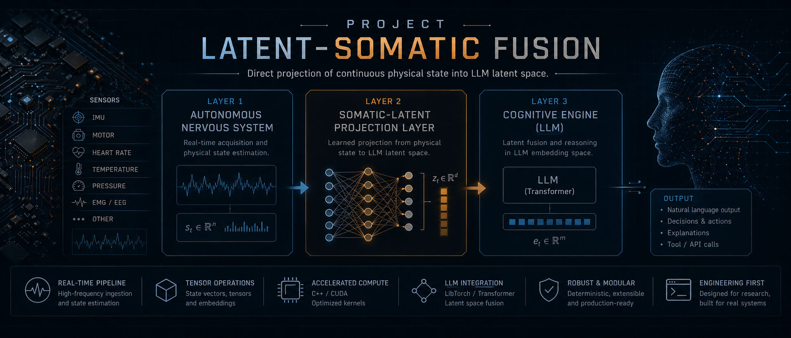

<div align="center">
  

  # Project Latent-Somatic Fusion

  **Direct projection of continuous physical state into LLM latent space**

  [](https://isocpp.org/)
  [](https://python.org)
  [](https://pytorch.org)
  [](https://github.com/ggml-org/llama.cpp)
  [](https://cmake.org)
  [](LICENSE)
  []()
  []()

  ```text
  S ∈ ℝ¹¹  →  φ(S) = Vₛ ∈ ℝ⁴⁰⁹⁶  →  Concat(Vₛ, E_text)  →  LLM forward pass
  ```

  *The body shapes the words.*

</div>

---

## What is this?

An open-hardware, open-source research platform that enables a Large Language Model to **perceive continuous physical reality** — voltage, heat, gravity, rotation — not as text tokens, but as **raw vectors injected directly into the KV cache** via `llama_batch.embd`.

Physical variables alter the LLM's attention mechanism at the embedding level, bypassing the tokenizer entirely. The architecture is aligned with the VLA/sensor-aware LLM research emerging in 2024–2025 (LLaSA, OmniVLA, SensorLLM).

## Current Status

What is real today:

- the C++ latent-somatic bridge and embedding-injection direction
- the LibTorch/TorchScript somatic projector path
- browser WebSocket runtime
- provider abstraction for `mock`, `linux`, and `endpoint`
- real Linux machine telemetry where available
- structured `speech + affect + actions` payloads

What is still prototype:

- Python orchestration layer as the runtime glue
- endpoint-based LLM chat (`openai_compatible` / `deepseek`)
- 2D avatar presentation instead of a 3D humanoid/VRM
- browser-side avatar styling instead of a full action/animation engine

The Python runtime is a validation layer for UX, telemetry, and protocol. The long-term runtime target remains the C++ path in `src/` plus `/home/funboy/llama.cpp`.

## Architecture

| Layer | Thread | Rate | Technology | Role |
| --- | --- | --- | --- | --- |
| **Autonomous NS** | dedicated | 100 Hz | I²C / Linux | Sensor polling, survival gate |
| **Somatic Projector** | cognitive | 5–20 Hz | LibTorch JIT | MLP: ℝ¹¹ → ℝ⁴⁰⁹⁶ |
| **Cognitive Engine** | cognitive | 5–20 Hz | llama.cpp | LLM inference with somatic injection |
| **WebSocket Server** | async | real-time | Python asyncio | Browser bridge, real tensor stream |

## Sensor Dimensions

| Index | Sensor | Unit | Hardware |
| --- | --- | --- | --- |
| 0 | Voltage | V | BQ34Z100 (BMS) |
| 1 | Current | mA | BQ34Z100 (BMS) |
| 2 | Temp Silicon | °C | TMP117 |
| 3 | Temp Motor L | °C | TMP117 |
| 4 | Temp Motor R | °C | TMP117 |
| 5–7 | Acceleration X/Y/Z | m/s² | ICM-42688-P |
| 8–10 | Gyroscope X/Y/Z | rad/s | ICM-42688-P |

## Quick Start

```bash
# 1. Reuse the existing llama.cpp checkout on this machine
LLAMA_CPP_ROOT=/home/funboy/llama.cpp
cmake -S "$LLAMA_CPP_ROOT" -B "$LLAMA_CPP_ROOT/build" -DGGML_CUDA=OFF
cmake --build "$LLAMA_CPP_ROOT/build" -j$(nproc)

# 2. Python environment
pip install torch sentence-transformers websockets pillow \
  --index-url https://download.pytorch.org/whl/cpu

# 3. Train somatic projector
python train/train_projector.py --epochs 200 --output weights/somatic_projector.pt

# 3b. Distill learned machine-fusion adapter
python train/train_machine_fusion.py --output weights/machine_fusion.pt

# 4. Build C++ binary
cmake -S . -B build \
  -DTORCH_DIR=$(python3 -c 'import torch; print(torch.utils.cmake_prefix_path)') \
  -DLLAMA_DIR="$LLAMA_CPP_ROOT"
cmake --build build -j$(nproc)

# 5. Launch production stack (Linux telemetry + WebSocket + frontend server)
DEEPSEEK_API_KEY=... \
DEEPSEEK_API_URL=http://127.0.0.1:4000 \
MEDIUM_DEEPSEEK_MODEL=gemini-web \
bash scripts/run_production.sh
# → http://127.0.0.1:8080/simulator.html?ws_port=8765
```

## Runtime Modes

```bash
# Mock provider, no external LLM
SOMA_SENSOR_PROVIDER=mock \
SOMA_LLM_MODE=off \
python3 server.py

# Real Linux telemetry, no external LLM
SOMA_SENSOR_PROVIDER=linux \
SOMA_LLM_MODE=off \
python3 server.py

# OpenAI-compatible endpoint
SOMA_SENSOR_PROVIDER=linux \
SOMA_LLM_MODE=openai_compatible \
SOMA_LLM_ENDPOINT=http://127.0.0.1:8081/v1/chat/completions \
SOMA_LLM_MODEL=local \
python3 server.py

# DeepSeek endpoint
SOMA_SENSOR_PROVIDER=linux \
SOMA_LLM_MODE=deepseek \
SOMA_DEEPSEEK_API_KEY=your_key \
SOMA_DEEPSEEK_MODEL=deepseek-v4-flash \
python3 server.py
```

`SOMA_LLM_MODE=deepseek` targets DeepSeek's chat completions API, while `openai_compatible` remains the generic path for local or hosted OpenAI-style endpoints.

For local proxy setups, `server.py` also accepts the alias variables `OPENAI_API_URL`, `OPENAI_API_KEY`, `DEEPSEEK_API_URL`, and `DEEPSEEK_API_KEY`. Base URLs such as `http://127.0.0.1:4000` or `http://127.0.0.1:4000/v1` are expanded automatically to the correct chat-completions path.

The runtime now loads `weights/machine_fusion.pt` when present and uses it as the primary learned machine-to-latent fusion path, with analytic fusion retained only as a fallback.

Runtime memory and backend actuation state are persisted under `data/` and intentionally ignored by git:

- `data/memory/semantic_memory.json`
- `data/memory/episodic_memory.jsonl`
- `data/memory/consolidated_memory.json`
- `data/runtime/actuation_state.json`
- `data/runtime/actuation_history.jsonl`

The current Python orchestrator is still a prototype layer. The active implementation backlog now lives in [docs/DEVELOPMENT_TODO.md](docs/DEVELOPMENT_TODO.md).

On this machine there is already a local `llama.cpp` checkout at `/home/funboy/llama.cpp`; use that path for integration work instead of cloning another copy.

## Documentation

- [Architecture](docs/ARCHITECTURE.md)
- [Runtime Modes](docs/RUNTIME_MODES.md)
- [WebSocket Protocol](docs/WEBSOCKET_PROTOCOL.md)
- [Sensor Providers](docs/SENSOR_PROVIDERS.md)
- [Development Todo](docs/DEVELOPMENT_TODO.md)

## Repository Layout

```text
latent-somatic/
├── src/
│   ├── main.cpp              ← orchestration, 3-layer startup
│   ├── hw_interface.cpp      ← I²C polling (100 Hz) + sinusoidal mock
│   ├── somatic_projector.cpp ← LibTorch MLP forward pass
│   └── llm_bridge.cpp        ← llama_batch.embd injection into KV cache
├── include/                  ← C++ headers
├── train/
│   ├── train_projector.py    ← InfoNCE contrastive training (CLIP-style)
│   └── train_machine_fusion.py ← learned machine-fusion distillation
├── weights/
│   ├── somatic_projector.pt  ← TorchScript (torch::jit::load in C++)
│   ├── machine_fusion.pt     ← learned machine-to-latent fusion module
│   └── somatic_projector_adapter.pth
├── server.py                 ← WebSocket production server (real tensors)
├── data/                     ← persistent memory + backend actuation state
├── docs/
│   ├── index.html            ← technical documentation
│   └── simulator.html        ← interactive entity body + live chat
├── scripts/
│   └── run_production.sh     ← launches backend + frontend together
└── CMakeLists.txt
```

## Key Technical Mechanisms

### Somatic Injection (`llm_bridge.cpp`)
```cpp
// The body root token: no tokenizer, raw float pointer
decode_batch_embd(somatic_vec, 1, n_embd_, seq_id=0, pos=0);
// Text tokens follow at pos=1..N
decode_batch_tokens(token_ids, seq_id=0, pos=1);
// Transformer attends over [Vₛ | text_tokens] natively
```

### Contrastive Training (`train/train_projector.py`)
```python
# InfoNCE symmetric loss (CLIP-style)
# Aligns physical states with semantic descriptions in ℝ⁴⁰⁹⁶
L = InfoNCE(project(sensor_state), text_adapter(text_embedding))
# Temperature τ learned: 14.2 → 17.2 over 200 epochs, best loss 0.93
```

### WebSocket Real-Time Bridge (`server.py`)
```python
# Real projector forward pass streamed to browser
somatic = projector(sensor_tensor)           # ℝ⁴⁰⁹⁶
heatmap = somatic[::16].tolist()            # 256 samples
broadcast({'type': 'tick', 'heatmap': heatmap, 'sensors': S, 'norm': ...})
```

## Related Research

| Paper | Year | Relevance |
| --- | --- | --- |
| **LLaSA** — Sensor-Aware LLM for IMU | 2025 | Identical projection-layer architecture |
| **OmniVLA** — Multi-Sensor Perception | 2025 | Per-sensor MLP → shared token space |
| **SensorLLM** — Aligning LLMs with Sensors | 2024–25 | Contrastive alignment of time-series |
| **LLaVA** — Language and Vision Assistant | 2023 | Same `llama_batch.embd` mechanism |
| **CLIP** — Contrastive Language-Image | 2021 | InfoNCE loss foundation |

## Hardware Bill of Materials

| Component | Part | Interface | Purpose |
| --- | --- | --- | --- |
| Battery Monitor | TI BQ34Z100-G1 | I²C 0x55 | Voltage, current |
| IMU | InvenSense ICM-42688-P | I²C 0x68 | 6-axis motion |
| Thermistor ×3 | TI TMP117 | I²C 0x48-4A | Silicon + motor temps |
| Compute | Raspberry Pi 5 / Jetson | GPIO | CPU/GPU inference |
| Motor Driver | PCA9685 | I²C | PWM actuation |

## Requirements

- **C++**: GCC ≥ 13, CMake ≥ 3.20 (`pip install cmake`)
- **Python**: 3.12+, PyTorch ≥ 2.3, websockets, sentence-transformers
- **Hardware**: Linux I²C bus (optional — mock mode works without)
- **LLM**: Any GGUF model via llama.cpp (optional for WebSocket mode)

---

<div align="center">
  <sub>Project Latent-Somatic Fusion v2.0 · C++ / LibTorch / llama.cpp / PyTorch / WebSocket</sub>
</div>
